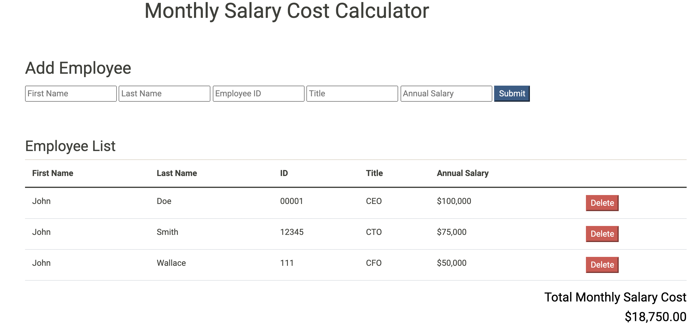

# jQuery Salary Calculator

Weekend Challenge

## Description

The application takes in inputs of employee name, id, title, and annual salary.  Using a submit button, the input values are transferred to the DOM and the inputs are cleared to allow for additional employee input.  When employee info is transferred to a table in the DOM, the monthly salary cost of all employees is summed and displayed in the DOM as well.  After hitting $20,000 in monthly salary costs, the display for Total Monthly Salary Cost will turn red.
A delete button is included for each employee to remove that specific employee from the DOM.  The total monthly salary cost is readjusted to reflect the fired employee.

## Screen Shot:

